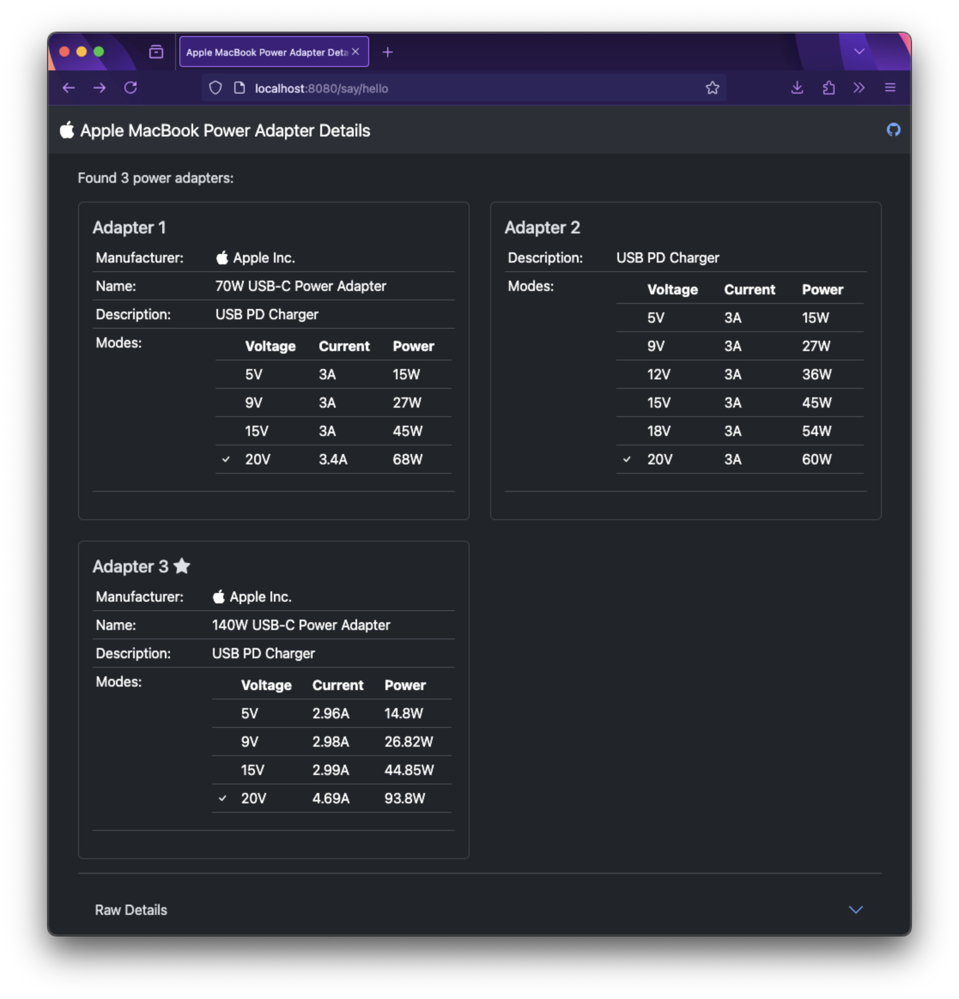

# Mac Power Adapter Details

Use your MacBook as a USB-PD tester.

Tested only on a MacBook Pro with M4 Pro chip, running MacOS Sequoia 15.1.1. It may run and work on other hardware, but you may need to run or compile using [Deno](https://deno.com).

## Web Server Usage:

Run `./mac-adapter-server` from the command line, or just double-click it.

Then open http://localhost:8080 in your browser.

## CLI Usage:

Run `./mac-adapter` from the command line, or just double-click it.

## Markdown Output Examples:

Adapter 1 ★ Best
* Manufacturer: Apple Inc.
* Name: 140W USB-C Power Adapter
* Description: USB PD Charger
* Modes: 
  * 5V 2.96A (14.8W)
  * 9V 2.98A (26.82W)
  * 15V 2.99A (44.85W)
  * 20V 4.69A (93.8W) ✔ Active

---

Adapter 2
* Manufacturer: Apple Inc.
* Name: 70W USB-C Power Adapter 
* Description: USB PD Charger
* Modes:
  * 5V 2.96A (14.8W)
  * 9V 2.98A (26.82W)
  * 15V 2.99A (44.85W)
  * 20V 3.39A (67.8W)

---

Adapter 3
* Manufacturer: Apple Inc.
* Name: 20W USB-C Power Adapter
* Description: USB PD Charger
* Modes:
  * 5V 3A (15W)
  * 9V 2.22A (19.98W)

---

Adapter 4
* Description: USB PD Charger
* Modes: 
  * 5V 2.96A (14.8W)
  * 9V 2.98A (26.82W)
  * 12V 2.98A (35.76W)
  * 15V 2.99A (44.85W)
  * 18V 2.99A (53.82W)
  * 20V 2.99A (59.8W)

---

Adapter 5
* Description: USB PD Charger
* Modes:
  * 5V 2A (10W)
  * 9V 2A (18W)
  * 12V 1.5A (18W)

---

Adapter 6
* Description: USB PD Charger
* Modes:
  * 5V 3A (15W)
  * 9V 2.22A (19.98W)

---

Adapter 7
* Description: USB Host
* Voltage: 5V
* Current: 3A
* Power: 15W

---

Adapter 8
* Description: USB PD Charger
* Voltage: 5V
* Current: 0.9A
* Power: 5W
